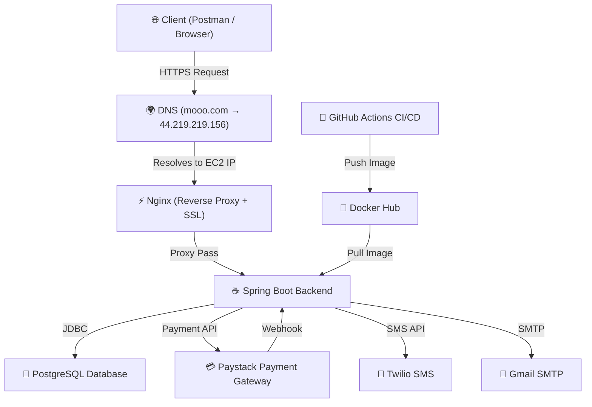
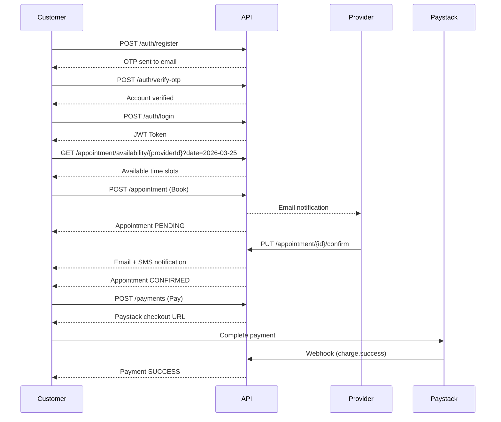

# 📅 Appointment Booking System

A production-ready **backend REST API** for appointment booking, built with **Spring Boot**, deployed on **AWS EC2** with **Docker**, **Nginx**, and **SSL**.

[](https://github.com/kofidhope/Appointment-booking-system/actions)
[](https://www.java.com)
[](https://spring.io/projects/spring-boot)
[](https://www.docker.com)
[](https://www.postgresql.org)
[](https://aws.amazon.com)
[](LICENSE)

---

## 🌐 Live API

```
https://easebook.mooo.com/api/v1
```

> Swagger UI: [https://easebook.mooo.com/swagger-ui.html](https://easebook.mooo.com/swagger-ui.html)

---

## 🏗️ System Architecture



---

## 🔄 Appointment Flow



---

## 🗄️ Database Schema


---

## 🚀 Tech Stack

| Layer | Technology |
|-------|-----------|
| Language | Java 17 |
| Framework | Spring Boot 3.3.7 |
| Security | Spring Security + JWT |
| Database | PostgreSQL 16 |
| ORM | Spring Data JPA + Hibernate |
| Payment | Paystack |
| SMS | Twilio |
| Email | Gmail SMTP + Thymeleaf |
| Containerization | Docker + Docker Compose |
| Reverse Proxy | Nginx |
| SSL | Let's Encrypt (Certbot) |
| Cloud | AWS EC2 (t2.micro) |
| CI/CD | GitHub Actions |
| Documentation | Swagger UI (SpringDoc) |

---

## 📦 Dependencies

```xml
<!-- Spring Boot Starters -->
<dependency>spring-boot-starter-web</dependency>
<dependency>spring-boot-starter-data-jpa</dependency>
<dependency>spring-boot-starter-security</dependency>
<dependency>spring-boot-starter-mail</dependency>
<dependency>spring-boot-starter-thymeleaf</dependency>
<dependency>spring-boot-starter-actuator</dependency>
<dependency>spring-boot-starter-validation</dependency>

<!-- Database -->
<dependency>postgresql (runtime)</dependency>

<!-- JWT -->
<dependency>jjwt-api 0.12.6</dependency>
<dependency>jjwt-impl 0.12.6</dependency>
<dependency>jjwt-jackson 0.12.6</dependency>

<!-- Payment -->
<dependency>paystack-java 2.0.0</dependency>
<dependency>stripe-java 24.3.0</dependency>

<!-- SMS -->
<dependency>twilio 10.1.5</dependency>

<!-- Rate Limiting -->
<dependency>bucket4j-core 8.10.1</dependency>

<!-- API Documentation -->
<dependency>springdoc-openapi-starter-webmvc-ui 2.3.0</dependency>

<!-- Utilities -->
<dependency>lombok</dependency>
<dependency>jackson-databind</dependency>

<!-- Testing -->
<dependency>spring-boot-starter-test (test scope)</dependency>
<dependency>spring-security-test (test scope)</dependency>
```

---

## 🌍 DNS & Domain Setup

The API is accessible via a custom domain configured as follows:

| Component | Value |
|-----------|-------|
| Domain Provider | [mooo.com](https://mooo.com) (free subdomain) |
| Domain | `easebook.mooo.com` |
| DNS Record | A Record → `44.219.219.156` (AWS Elastic IP) |
| SSL Certificate | Let's Encrypt (auto-renewed via Certbot) |
| Reverse Proxy | Nginx (HTTP → HTTPS redirect) |

### How it works:
```
Browser → easebook.mooo.com
       → DNS resolves to 44.219.219.156 (AWS Elastic IP)
       → Nginx on port 443 (HTTPS)
       → Spring Boot on port 8088 (internal)
```

---

## 📌 API Endpoints

### 🔐 Authentication
| Method | Endpoint | Description | Auth |
|--------|----------|-------------|------|
| POST | `/api/v1/auth/register` | Register new user | Public |
| POST | `/api/v1/auth/verify-otp` | Verify OTP | Public |
| POST | `/api/v1/auth/login` | Login | Public |
| POST | `/api/v1/auth/resend-otp` | Resend OTP | Public |
| POST | `/api/v1/auth/refresh` | Refresh token | Public |
| POST | `/api/v1/auth/logout` | Logout | Bearer Token |
| POST | `/api/v1/auth/forgot-password` | Forgot password | Public |
| POST | `/api/v1/auth/reset-password` | Reset password | Public |

### 📅 Appointments
| Method | Endpoint | Description | Auth |
|--------|----------|-------------|------|
| POST | `/api/v1/appointment` | Book appointment | Customer |
| PUT | `/api/v1/appointment/{id}/confirm` | Confirm appointment | Provider |
| PUT | `/api/v1/appointment/{id}/reject` | Reject appointment | Provider |
| PUT | `/api/v1/appointment/{id}/cancel` | Cancel appointment | Customer/Provider |
| GET | `/api/v1/appointment/my-appointments` | Get my appointments | Bearer Token |
| GET | `/api/v1/appointment/availability/{providerId}` | Get available slots | Public |

### 💳 Payments
| Method | Endpoint | Description | Auth |
|--------|----------|-------------|------|
| POST | `/api/v1/payments` | Create payment | Customer |
| POST | `/api/v1/payments/{id}/refund` | Refund payment | Customer |
| POST | `/api/v1/payments/webhook/paystack` | Paystack webhook | Public |

### 👨‍⚕️ Providers
| Method | Endpoint | Description | Auth |
|--------|----------|-------------|------|
| POST | `/api/v1/providers/create/providers` | Create provider | Admin |
| POST | `/api/v1/providers/services` | Create service | Provider |
| GET | `/api/v1/providers/{id}/services` | Get provider services | Public |
| GET | `/api/v1/providers/providers` | Get all providers | Public |

### 📆 Availability
| Method | Endpoint | Description | Auth |
|--------|----------|-------------|------|
| POST | `/api/v1/provider/availability` | Set availability | Provider |
| GET | `/api/v1/provider/availability/{providerId}` | Get availability | Public |
| DELETE | `/api/v1/provider/availability/{id}` | Delete availability | Provider |

### 👤 User Profile
| Method | Endpoint | Description | Auth |
|--------|----------|-------------|------|
| GET | `/api/v1/users/me` | Get current user | Bearer Token |
| PUT | `/api/v1/users/me` | Update profile | Bearer Token |
| GET | `/api/v1/users/{id}` | Get user by ID | Admin |

### 📊 Admin
| Method | Endpoint | Description | Auth |
|--------|----------|-------------|------|
| GET | `/api/v1/admin/report/daily` | Daily report | Admin |
| GET | `/api/v1/admin/report/range` | Range report | Admin |
| GET | `/api/v1/admin/audit-logs` | All audit logs | Admin |
| GET | `/api/v1/admin/audit-logs/appointment/{id}` | Appointment logs | Admin |

---

## 🔒 Security Features

- ✅ JWT Authentication with refresh token rotation
- ✅ Account lockout after 5 failed login attempts (10 min lock)
- ✅ OTP email verification on registration
- ✅ Password reset via OTP
- ✅ Rate limiting on auth endpoints (20 req/min per IP)
- ✅ Strong password validation
- ✅ Paystack webhook signature verification (HMAC-SHA256)
- ✅ Role-based access control (CUSTOMER, SERVICE_PROVIDER, ADMIN)

---

## 🔔 Notifications

- 📧 Email on registration (OTP)
- 📧 Email on new booking (to provider)
- 📧 Email on booking confirmed (to customer)
- 📧 Email on booking cancelled/rejected
- 📧 Email on payment refunded
- 📱 SMS on booking confirmed (via Twilio)
- ⏰ Automated reminder email 24 hours before appointment

---

## ⚙️ Scheduled Jobs

| Job | Schedule | Description |
|-----|----------|-------------|
| Pending booking cleanup | Every 5 mins | Expires old pending bookings |
| Appointment reminders | Daily at 8 AM | Sends reminder emails |
| Refresh token cleanup | Daily at midnight | Deletes revoked tokens |

---

## 🐳 Deployment

### Prerequisites
- Docker & Docker Compose
- AWS EC2 instance
- Domain name
- Paystack account
- Twilio account
- Gmail account

### Environment Variables
Create a `.env` file:
```env
DB_USERNAME=your_db_username
DB_PASSWORD=your_db_password
DB_NAME=your_db_name
DB_URL=jdbc:postgresql://postgres:5432/your_db_name
JWT_SECRET=your_jwt_secret
JWT_EXPIRATION=900000
PAYSTACK_SECRET_KEY=sk_test_xxx
PAYSTACK_PUBLIC_KEY=pk_test_xxx
TWILIO_ACCOUNT_SID=ACxxx
TWILIO_AUTH_TOKEN=xxx
TWILIO_PHONE_NUMBER=+1xxxxxxxxxx
MAIL_USERNAME=your@gmail.com
MAIL_PASSWORD=your_app_password
```

### Run with Docker Compose
```bash
git clone https://github.com/kofidhope/Appointment-booking-system.git
cd Appointment-booking-system
docker-compose up -d
```

### CI/CD Pipeline
Every push to `main` branch automatically:
1. Builds the Java project
2. Runs tests
3. Builds and pushes Docker image to Docker Hub
4. Deploys to AWS EC2

---

## 📁 Project Structure

```
Appointment-booking-system/
├── backend/
│   └── src/main/java/com/kofi/booking_system/
│       ├── admin/          # Admin reports & audit logs
│       ├── appointment/    # Booking, scheduling, notifications
│       ├── auth/           # JWT, OTP, security
│       ├── common/         # Exceptions, utilities
│       ├── config/         # App configuration
│       ├── payment/        # Paystack integration
│       ├── providerService/# Provider & availability
│       ├── scheduler/      # Cleanup & reminder jobs
│       └── user/           # User management
├── nginx/
│   ├── nginx.conf          # Nginx configuration
│   └── ssl/                # SSL certificates
├── docker-compose.yml      # Docker services
└── deploy.sh               # Deployment script
```

---

## 👨‍💻 Author

**Forson Bentum**
- GitHub: [@kofidhope](https://github.com/kofidhope)

---
